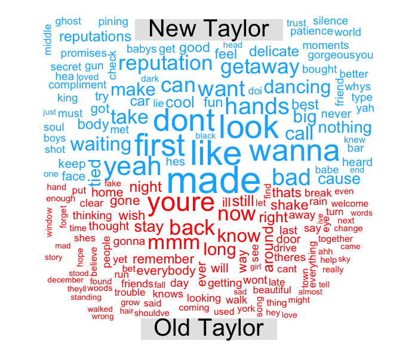
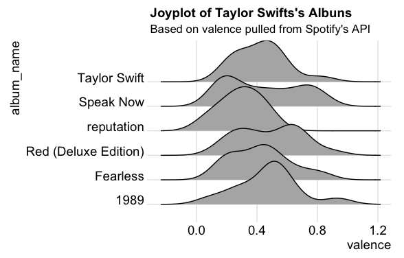

# musixmatchR
Wrapper written in R for getting metadata about songs, bands, artists and lyrics from Musixmatch.

## Getting Started

This package allows you to get data from MusixMatch database. I started using the API to access band's lyrics and I thought it would be a great opportunity to share it with other people that have the same needs =)


### Prerequisites

First things first: To use the package without difficulty, it is important that you create an application to provide you an API Key from MusixMatch. 
An easy way to do so is accessing [MusixMatch Developers Page](https://developer.musixmatch.com/admin/applications) . After you create an application, a Key will be provided to you. 
This key is very important for you to be able to access all features on the package.

### Installing
To get **musixmatchR** running, you have to use **devtools** since it is not available on CRAN yet.

```r
library(devtools)
install_github("fernandabruno/musixmatchR")
```
To make the package simpler to use, it is important that you create a object called *apikey* to store your API Key and to use it as a parameter as you call the functions.
For example:

```r
apikey<-"YOUR_API_KEY"
```

## Accessing data
With your created api key, you are ready to access all the funcionalities provided by musixmatchR package. 
Let's give it a try.

### Getting data about Artists or Bands

It searches Musixmatch database for a provided band, singer or artist.

```r
artists <- getArtists("Taylor Swift",apikey)
|    artist_id |                          artist_name  |artist_country|artist_rating|twiter_url
|1     259675  |                       Taylor Swift    |         US   |        95   |https://twitter.com/taylorswift13
|2   24451377  |                テイラー・スウィフト     |              |        17   |
|3   34690605  | Taylor Swift feat. Ed Sheeran & Future|              |        61   |
|4   32915417  |               ZAYN feat. Taylor Swift |              |        61   |
|5   13920947  |              B.o.B feat. Taylor Swift |              |        39   |
|6   28705075  |     Taylor Swift feat. Kendrick Lamar |              |        45   |
|7   14015404  |         Taylor Swift feat. Ed Sheeran |              |        45   |
|8   13903196  |     Taylor Swift feat. The Civil Wars |              |        45   |
|9   13864003  |    Boys Like Girls feat. Taylor Swift |              |        40   |
|10  13814620  |     Taylor Swift feat. Colbie Caillat |              |        31   |                        
```
### Getting data about a song

It searches Musixmatch database for a provided band, singer or artist.

```r
searchTrack("Taylor Swift","Blank Space",apikey)
head(track,1)
|track_id id|nomes      |track_rating|track_length|track_has_lyrics|track_richsync|track_numfavs|album_name|track_release1 
|1 73446912 |Blank Space|83          |232         |       1        |             1|       118931|     1989 |2014-01-01T00:00:00Z
```

### Getting data bands related to an artist

It gets a list of artists somehow related to a given one by its artist_id.

```r
getRelated(259675,apikey)

artist_id     |artist_name    |artist_country|artist_rating | twiter_url
1       1039  |Coldplay       |      GB      |      93      | https://twitter.com/coldplay
2       7014  |black eyed peas|      US      |      822     | https://twitter.com/bep
3      31317  |Kelly Clarkson |      US      |      803     | https://twitter.com/kelly_clarkson
4     190034  |Katy Perry     |      US      |      884     | https://twitter.com/katyperry
5     224210  |Miley Cyrus    |      US      |      855     | https://twitter.com/mileycyrus
6     276398  |Hannah Montana |      US      |      676     |                    
7     378462  |Lady Gaga      |      US      |      888     | https://twitter.com/ladygaga  
8   33491420  |Britney Spears |      US      |      83      | https://twitter.com/britneyspears
9   33491890  |Rihanna        |      US      |      919     | https://twitter.com/rihanna 
10  33492237  |Bruno Mars     |      US      |      93      | https://twitter.com/BRUNOMARS 
```

### Getting data about a provided album
It gets data about an album based on its album_id.

```r
getAlbum(19649460,apikey)

  artist_id| artist_name|album_id|album_name|album_rating|album_track_count|album_release_date|album_label             
1 259675   |Taylor Swift|19649460|  1989    |    100      |   13            |2014-01-01       |Album Universal Music Group International
```

### Getting lyrics from a song

It gets the lyrics of a specific song.

```r
getLyrics(19649460,apikey)

  track_id|lyrics_id|explicit|instrumental|  lyrics_body
1 73446912| 10271112|  0     |     0      | Nice to meet you, where you been? I could show you incredible things Magic, madness, heaven, sin Saw you there and I thought "Oh, my God, look at that face!" You look like my next mistake Love's a game, wanna play?  New money, suit and tie I can read you like a magazine Ain't it funny? Rumors fly And I know you heard about me So hey, let's be friends I'm dying to see how this one ends Grab your passport and my hand I can make the bad guys good for a weekend  So it's gonna be forever Or it's gonna go down in flames You can tell me when it's over If the high was worth the pain Got a long list of ex-lovers They'll tell you I'm insane 'Cause you know I love the players And you love the game  'Cause we're young and we're reckless We'll take this way too far It'll leave you breathless Or with a nasty scar Got a long list of ex-lovers ...  ******* This Lyrics is NOT for Commercial use ******* (1409617466548)
```
#Cool Examples

A simple and cool example is creating a Word Cloud based on the most used words from a singer. 
I created a Comparison Cloud based on words that are present on the early Taylor Swift fase (until *1989* album) and her new fase (*Reputation*).

<center></center>

Another cool approach is combining data from MusixMatch and Spotify API. What about checking if the old Taylor is dead?
Let's use Valence to get the answer. Valence describes whether something is likely to make someone feel happy or sad. So... What about new Taylor Swift's songs? Using valence metadata from Taylor songs, it looks like the old Taylor is, in fact, dead. Or isn't she? 

<center></center>
